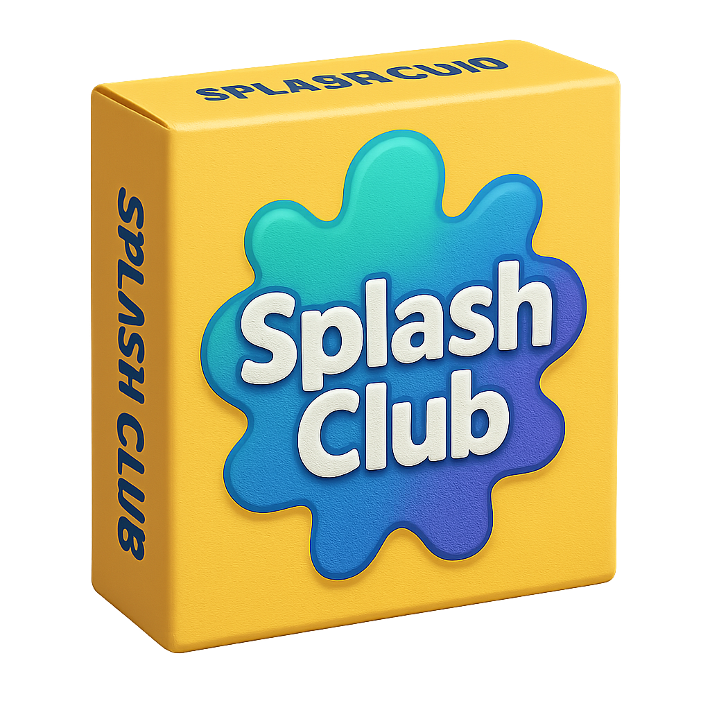

# Splash Club



This is a fork and major modernization of the jill_box repo: https://github.com/axlan/jill_box. 

This demo game is similar to Fibbage, where players create fake answers to prompts and try to guess the real ones.

## Getting Started

### Prerequisites
- [uv](https://docs.astral.sh/uv/) (Python package manager)
- [Node.js](https://nodejs.org/) version 23 and [Yarn](https://yarnpkg.com/)

### Installation

```bash
git clone git@github.com:BreakTheBeta/SplashClub.git
cd SplashClub
uv sync 
cd client
yarn install
cd ..
```

### Running the Game

Start the server:
```bash
make server
```

In a separate terminal, start the client:
```bash
make client
```

The game will be available at `http://localhost:3000` (or the port shown in your terminal).

## Todo List

- [x] Disconnect/reconnect logic to stay in game
- [ ] Clean up App.tsx
- [ ] Add sound effects and other assets
- [ ] Add room owner privileges