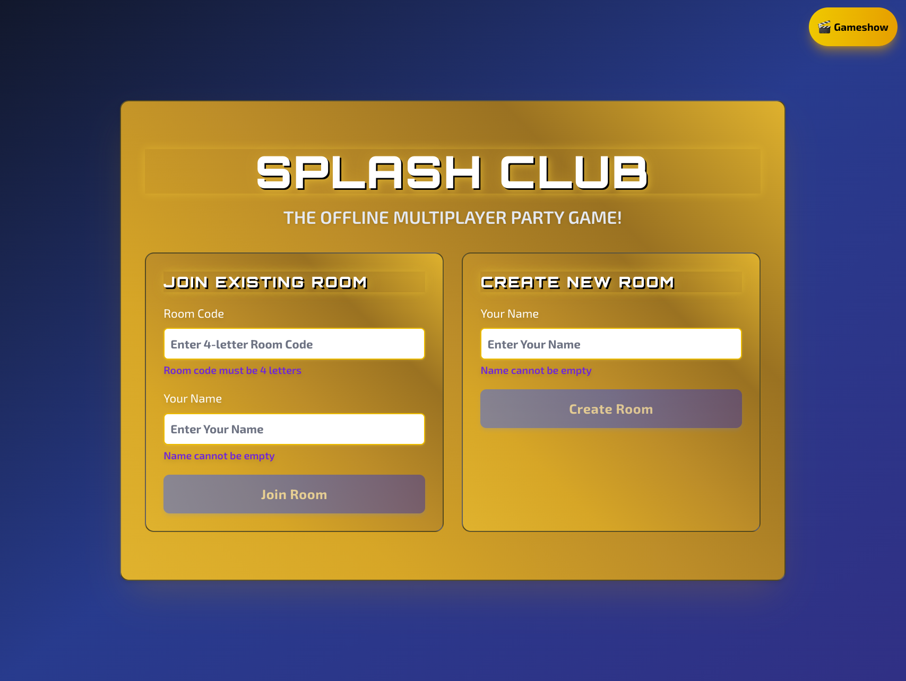
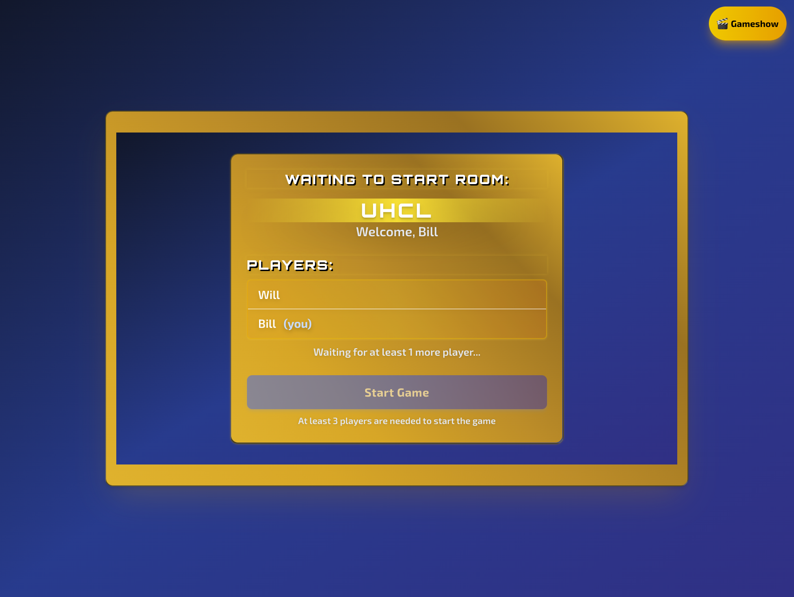
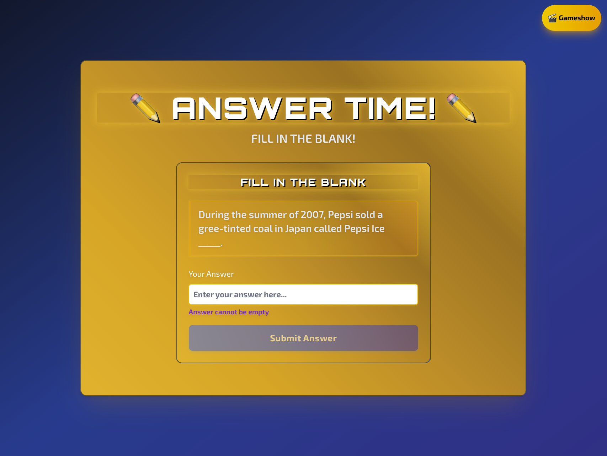

# Splash Club


This is a fork and major modernisation of the jill_box repo: https://github.com/axlan/jill_box. 

This demo game is similar to Fibbage, where players create fake answers to prompts and try to guess the real ones.

## Getting Started

### Prerequisites
- [uv](https://docs.astral.sh/uv/) (Python package manager)
- [Node.js](https://nodejs.org/) version 23 and [Yarn](https://yarnpkg.com/)

### Installation

```bash
git clone git@github.com:BreakTheBeta/SplashClub.git
cd SplashClub
uv sync 
cd client
yarn install
cd ..
```

### Running the Game


## Development Environment Management

This project uses `make` to manage development services (like the backend server and frontend development server).

### Prerequisites

Ensure you have `make` installed on your system.

### Service Configuration

Services are defined in the `Makefile`:

*   `SERVICE_NAMES`: A list of short names for your services (e.g., `server`, `client`).
*   `<name>_CMD`: The command to start the service (e.g., `python3 main.py`).
*   `<name>_WORKDIR`: The working directory for the command (defaults to `.` if not specified).

All service-related files (PID files, log files) are stored in the `.services/` directory at the root of the project.

### Common Commands

*   **`make help`**: Displays a list of all available make targets and their descriptions. This is the best way to see all options.

*   **`make run-<service_name>`**: Starts the specified service in the background.
    *   Example: `make run-server`
    *   It will print ✅ and the Process ID (PID) if successful.
    *   If the service was already running, it will stop the old instance and start a new one.
    *   The first 20 lines of the service's log will be shown.

*   **`make run-<service_name> ATTACH=1`**: Starts the specified service in the foreground.
    *   Example: `make run-client ATTACH=1`
    *   Useful for interactive debugging or seeing live output directly in your terminal.
    *   Press `Ctrl+C` to stop the service.

*   **`make status`**: Shows the current running status (running or not running) and PID for all defined services.

*   **`make log-<service_name>`**: Tails the full log file for the specified service.
    *   Example: `make log-server`
    *   Press `Ctrl+C` to stop viewing logs.

*   **`make kill-<service_name>`**: Stops the specified running service.
    *   Example: `make kill-server`

### Other Useful Commands

*   **`make clean`**: Removes Python cache files (`*.pyc`) and the `.services/` directory (which contains PID and log files for services).
*   **`make test`**: Runs Python tests using `uv run pytest`.
*   **`make gen_types`**: (If applicable to your project) Generates TypeScript types from Pydantic models.

**Example Workflow:**

1.  Start the backend server: `make run-server`
2.  Start the frontend client: `make run-client`
3.  Check their status: `make status`
4.  View server logs: `make log-server`
5.  Stop the server: `make kill-server`


## Screenshots





## Todo List

- [x] Disconnect/reconnect logic to stay in game
- [x] Clean up App.tsx
- [ ] Add sound effects and other assets
- [x] Add room owner privileges
